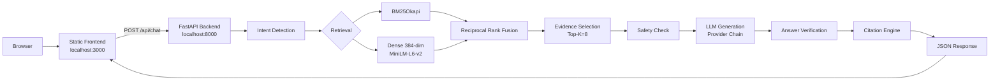

# Clinical Evidence Copilot — Diabetes Edition

A Retrieval-Augmented Generation system for diabetes medical information, using ADA Standards of Care 2026 and NIDDK sources. Built for the Clinical Evidence Copilot hackathon.

**What it does:** Ask a question about diabetes diagnosis, thresholds, or treatment — the system retrieves evidence from authoritative clinical sources, grounds the answer in retrieved chunks, provides per-statement citations, and refuses when safety or evidence thresholds are not met.

---

## Architecture



**Provider chain** — Gemini 2.0 Flash → Groq Llama 3.3 70B → OpenRouter GPT-OSS 20B → Refusal fallback. Automatic failover with 30 s per-provider timeout.

---

## Tech Stack

| Layer | Technology |
|-------|-----------|
| Frontend | Vanilla JS (ES6 modules), CSS design system |
| Backend | Python 3.13, FastAPI, Uvicorn |
| Embeddings | `sentence-transformers/all-MiniLM-L6-v2` (384-dim) |
| Vector DB | ChromaDB (persistent, cosine distance) |
| Lexical search | `rank_bm25.BM25Okapi` |
| LLM providers | Google Gemini 2.0 Flash, Groq Llama 3.3 70B, OpenRouter GPT-OSS 20B (free tier) |
| Reranker | BAAI/bge-reranker-base (disabled) |
| PDF extraction | PyMuPDF (`fitz`) |
| QA tool | Playwright (visual regression) |

---

## Project Structure

```
diabetes-rag/
├── backend/
│   └── app/
│       ├── config.py                         # Frozen configuration & source registry
│       ├── main.py                           # FastAPI routes: /health, /api/chat, /api/sources, /api/evidence, /api/citations
│       ├── ingestion/
│       │   ├── parser.py                     # PyMuPDF PDF extraction
│       │   ├── loader.py                     # Source metadata application
│       │   ├── metadata.py                   # Section detection & enrichment
│       │   └── chunker.py                    # Source-aware chunking (parent/child)
│       ├── retrieval/
│       │   ├── embeddings.py                 # Sentence-transformers embeddings
│       │   ├── vector_store.py               # ChromaDB persistent store
│       │   ├── hybrid_search.py              # BM25Okapi lexical search
│       │   ├── retriever.py                  # Unified hybrid retriever
│       │   ├── reranker.py                   # CrossEncoder reranking
│       │   ├── intent_v2.py                  # Intent detection & NIDDK routing
│       │   ├── enhanced_retriever.py         # Evidence selection pipeline
│       │   └── query_expansion.py            # Medical terminology expansion (no LLM)
│       ├── generation/
│       │   ├── prompt.py                     # Prompt construction, 8 refusal reasons
│       │   ├── llm.py                        # Provider chain, confidence assessment
│       │   ├── providers.py                  # Gemini → Groq → OpenRouter chain
│       │   ├── safety.py                     # Regex risk pattern detection
│       │   ├── answer_verifier.py            # Post-generation verification (5 checks)
│       │   └── citation_engine.py            # Citation deduplication
│       └── evidence/
│           ├── evidence_validator.py         # Grounding score calculation
│           └── conflict_detector.py          # Threshold conflict detection
├── frontend/
│   ├── index.html                            # SPA entry point
│   ├── src/
│   │   ├── app.js                            # App controller, chat initialization
│   │   ├── styles/
│   │   │   └── main.css                      # Clinical design system (~2600 lines)
│   │   ├── components/
│   │   │   ├── Chat/message.js               # Information hierarchy renderer
│   │   │   ├── Drawer/evidence-drawer.js     # Evidence detail panel
│   │   │   └── Evidence/conflict.js          # Threshold conflict display
│   │   ├── services/
│   │   │   ├── api.js                        # HTTP client
│   │   │   └── chats.js                      # LocalStorage persistence
│   │   └── utils/
│   │       ├── markdown.js                   # Markdown + LaTeX renderer
│   │       └── dom.js                        # DOM utilities
│   └── package.json
├── data/raw/
│   ├── ADA_Standards_of_Care_2026_Diagnosis.pdf
│   └── NIDDK_Diabetes_Prediabetes_Tests.pdf
├── tests/
│   ├── visual_qa.py                          # Playwright visual QA (169 checks)
│   └── api_test.py                           # API integration tests
├── scripts/
│   ├── build_index.py                        # Build ChromaDB + BM25 indices
│   ├── run_v2_eval.py                        # Run V2 evaluation
│   └── regression_test.py                    # Full pipeline regression test
├── vector_db/                                # ChromaDB persistent storage
├── logs/                                     # Evaluation results
├── .env.example                              # Environment variable template
├── requirements.txt                          # Python dependencies
└── docs/
    ├── frontend_api_contract.md              # API contract reference
    ├── PROJECT_REPORT.md                     # Detailed technical report
    └── PRESENTATION_CONTENT.md               # Hackathon presentation
```

---

## Quick Start

### Prerequisites
- Python 3.13
- Node.js (for `npx serve`)
- API keys: `GEMINI_API_KEY`, `GROQ_API_KEY`, `OPENAI_API_KEY` (environment variables)

### 1. Set up backend

```bash
# Create and activate virtual environment
python -m venv .venv
.\.venv\Scripts\activate          # Windows
# source .venv/bin/activate       # macOS/Linux

# Install dependencies
pip install -r requirements.txt

# Build search indices
python scripts/build_index.py

# Start backend (port 8000)
uvicorn backend.app.main:app --host 127.0.0.1 --port 8000
```

### 2. Start frontend (port 3000)

```bash
cd frontend
npx serve -s . -l 3000
```

### 3. Open browser

Navigate to `http://localhost:3000`

---

## Configuration

All configuration lives in `backend/app/config.py`. Key frozen parameters:

| Parameter | Value |
|-----------|-------|
| Embedding model | `sentence-transformers/all-MiniLM-L6-v2` |
| Embedding dimension | 384 |
| Chunk size (ADA) | 700 tokens |
| Chunk overlap (ADA) | 100 tokens |
| Top-K retrieved | 8 |
| Dense / BM25 weight | 0.6 / 0.4 |
| Similarity threshold | 0.35 |
| Reranker | Disabled |
| LLM (auto-failover) | Gemini → Groq → OpenRouter |
| Gemini model | `gemini-2.0-flash` |
| Groq model | `llama-3.3-70b-versatile` |
| OpenRouter model | `openai/gpt-oss-20b:free` |
| Provider timeout | 30 s |

---

## Data Sources

| Source | Pages | Chunks | Organization |
|--------|-------|--------|-------------|
| ADA Standards of Care 2026 — Diagnosis | 23 pp | 58 | American Diabetes Association |
| NIDDK Diabetes & Prediabetes Tests | 1 pp | 58 | NIH / NIDDK |

---

## Retrieval System

**Hybrid search** combines lexical (BM25) and semantic (dense cosine) retrieval:

1. **Query expansion** — medical terminology mappings (no LLM call)
2. **BM25 lexical search** — `rank_bm25.BM25Okapi`
3. **Dense semantic search** — ChromaDB with `all-MiniLM-L6-v2` embeddings, cosine distance
4. **Reciprocal Rank Fusion** — combines ranked lists (dense weight: 0.6)
5. **Evidence selection** — Top-K=8, filtered by `SIMILARITY_THRESHOLD=0.35`

**Evaluation results** (40-question test set):

| Metric | Value |
|--------|-------|
| Recall@5 | 1.0000 |
| MRR | 0.8236 |
| Source Accuracy | 1.0000 |
| Section Accuracy | 0.8739 |
| Retrieval latency | ~100 ms |

---

## Safety & Trust

The system enforces strict clinical safety boundaries:

**8 refusal reasons** — the system will refuse to answer when:
- `low_relevance` — query is outside diabetes domain
- `insufficient_evidence` — retrieved chunks do not support an answer
- `medical_advice` — user asks for personalized treatment or dosing
- `emergency` — emergency symptoms detected; system directs to emergency services
- `verification_failed` — post-generation check failed
- `no_safe_answer` — safety layer blocked the response
- `provider_failure` — all LLM providers failed
- `technical_error` — unrecoverable system error

**Answer verification** (5 checks) validates the LLM response against retrieved evidence before returning to the user.

**Risk detection** scans for treatment-change, emergency-symptoms, and dangerous-action patterns via regex.

---

## Frontend

Vanilla JavaScript single-page application (no build step, no framework):

- **Chat interface** — ask questions, view grounded answers
- **Evidence drawer** — click any source to see full chunk text with metadata
- **Confidence & grounding display** — visual indicators for high/medium/low confidence
- **Conflict display** — shows clinical threshold differences (informational blue notice) vs. genuine source disagreements (orange warning)
- **Responsive design** — 3-column grid at 1440 px, collapsed sidebar at ≤1024 px, mobile-optimized at ≤768 px
- **LaTeX normalization** — renders medical symbols (≥, ≤, ±, ×) from LLM output
- **Chat persistence** — recent conversations saved to localStorage (max 50)

---

## Testing

### Visual QA (Playwright)
```bash
python tests/visual_qa.py
```
- 169 automated checks across 6 viewports (1440, 1280, 1024, 768, 390, 375 px)
- Checks: zero horizontal overflow, zero console errors, all UI components render

### API integration
```bash
python tests/api_test.py
```
- FPG threshold question — answered
- Capital of France — refused (out of scope)
- Metformin dosage — refused (medical advice)
- Emergency symptoms — refused (emergency)
- Prediabetes diagnosis — answered

---

## License

Built for the Clinical Evidence Copilot hackathon. Data sources are copyrighted (ADA) and public domain (NIDDK).
