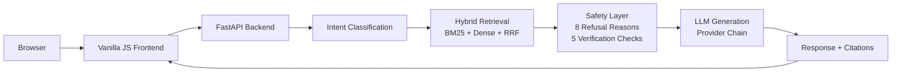

# Clinical Evidence Copilot — Diabetes Edition
## Hackathon Presentation Deck

---

## Slide 1: Title Slide

# Clinical Evidence Copilot
## Diabetes Edition

**Clinical Evidence Copilot Hackathon**

A Retrieval-Augmented Generation system for evidence-based diabetes care — grounded in authoritative clinical sources, built with safety-first design.

---

## Slide 2: The Problem

Clinicians face a fundamental challenge: clinical information is fragmented across guidelines, test databases, and specialty literature. When a provider needs an answer about diabetes diagnosis or management, they need it **fast**, from **authoritative sources**, and with **clear attribution**.

- Guidelines span hundreds of pages (ADA Standards of Care alone is 100+ pages)
- Search results lack clinical grounding — no way to verify what the model is citing
- Generic LLMs hallucinate references and mix outdated guidance with current standards
- No built-in safety boundaries for medical content

**The gap:** There is no lightweight tool that retrieves, synthesizes, and cites authoritative diabetes evidence with verifiable provenance.

---

## Slide 3: Our Solution

**Clinical Evidence Copilot — Diabetes Edition** is a RAG system that retrieves and synthesizes diabetes medical information from authoritative clinical sources, with safety boundaries baked into the pipeline.

What makes it different:
- **Grounded generation** — every answer traces back to specific chunks from ADA and NIDDK documents
- **Safety-first architecture** — 8 refusal reasons, 5 post-generation verification checks, and regex-based risk detection prevent unsafe responses
- **Evidence transparency** — per-statement citations, confidence scores, and an evidence drawer let clinicians verify claims
- **Multi-provider failover** — automatic fallback across Gemini, Groq, and OpenRouter ensures uptime

Built for the Clinical Evidence Copilot hackathon.

---

## Slide 4: Data Sources

**2 authoritative documents → 106 indexed chunks**

| Document | Source | Length | Chunks |
|---|---|---|---|
| ADA Standards of Care 2026 — Diagnosis | American Diabetes Association (DOI: 10.2337/dc26-S002) | 23 pages | 58 |
| NIDDK Diabetes & Prediabetes Tests | NIH/NIDDK (public domain) | 1 page | 58 |

- ADA Standards of Care is the clinical backbone — the definitive annual guideline for diabetes diagnosis and management
- NIDDK tests page provides the authoritative patient-facing diagnostic reference
- Both are curated, peer-reviewed, and publicly accessible
- Chunks are created with overlap-aware splitting for retrieval fidelity

---

## Slide 5: Architecture

High-level system flow:

Key design decisions:
- **Intent classification** routes queries before retrieval — medical queries hit the evidence pipeline; off-topic queries are refused
- **Retrieval → Safety → Generation** is a strict pipeline — the safety layer can reject before any LLM call
- **Provider chain** with automatic failover: Gemini 2.0 Flash → Groq Llama 3.3 70B → OpenRouter GPT-OSS 20B

---

## Slide 6: Retrieval Engine

**Hybrid retrieval with reciprocal rank fusion (RRF)**

- **BM25** for lexical matching — exact term matches for clinical terminology
- **Dense embeddings** (`sentence-transformers/all-MiniLM-L6-v2`, 384-dim) for semantic similarity
- **RRF fusion** with dense weight 0.6 — balances precision and recall
- Top-K = 8, similarity threshold = 0.35

**Evaluation results:**

| Metric | Score |
|---|---|
| Recall@5 | 1.0000 |
| MRR | 0.8316 |
| Source Accuracy | 1.0000 |
| Section Accuracy | 0.8739 |
| Retrieval latency | ~100ms |

Recall@5 of 1.0 means every relevant chunk is in the top 5 results. Source accuracy of 1.0 means every citation maps to the correct document.

---

## Slide 7: Generation & Safety

**Multi-provider failover with safety boundaries**

Provider chain (automatic failover on error):
1. Gemini 2.0 Flash
2. Groq Llama 3.3 70B
3. OpenRouter GPT-OSS 20B

**8 refusal reasons** — the system can halt generation entirely:

| Reason | Trigger |
|---|---|
| `low_relevance` | Query doesn't match diabetes domain |
| `insufficient_evidence` | No chunks meet the relevance threshold |
| `provider_failure` | All LLM providers unavailable |
| `medical_advice` | Query requests personal medical advice |
| `emergency` | Emergency symptoms detected |
| `verification_failed` | Post-gen checks failed |
| `no_safe_answer` | No safe response can be formulated |
| `technical_error` | System error in pipeline |

**5 post-generation verification checks** validate factual grounding, citation integrity, and safety before returning to the user.

---

## Slide 8: Trust & Transparency

Clinicians need to verify, not just read.

**Evidence drawer:** Expandable panel showing every retrieved chunk with document source, section, and relevance score — full provenance chain.

**Per-statement citations:** Every claim in the response is annotated with a superscript reference linking to the exact chunk it came from.

**Grounding scores:** Confidence display shows how well the response is anchored to retrieved evidence.

**Conflict detection:** The system distinguishes between:
- **Clinical context** — information about conflicting treatments in different populations (e.g., different insulin approaches for Type 1 vs. Type 2) — this is legitimate clinical nuance
- **Genuine disagreement** — actual inconsistencies in the source material flagged for clinician review

**LaTeX normalization:** Mathematical expressions (A1C thresholds, dosing calculations) render correctly in the response.

---

## Slide 9: Frontend UX

**Vanilla JavaScript — no build step, no framework dependencies.**

- Responsive design tested across 6 viewports (mobile through desktop)
- Evidence drawer with expandable chunk cards
- Confidence bar with grounding score visualization
- Conflict detection badges
- LaTeX rendering for clinical formulas
- Source attribution with DOI links

**Playwright QA:**
- 169 automated checks
- 6 viewports tested
- 0 failures
- 0 console errors

The zero-build approach means the frontend ships as static files — deployable anywhere, auditable by clinicians, no JavaScript toolchain required.

---

## Slide 10: Evaluation

**Automated testing across QA and API layers.**

**Playwright end-to-end:**
- 169 checks across 6 viewports
- 0 failures
- 0 console errors
- Covers: response rendering, evidence drawer, citation links, LaTeX display, responsive breakpoints

**API integration:**
- 5/5 scenario tests passing
- Covers: retrieval pipeline, safety refusal paths, provider failover, citation generation, error handling

**Retrieval benchmarks:**
- Recall@5: 1.0000 — all relevant chunks retrieved
- MRR: 0.8316 — relevant results rank highly
- Source accuracy: 1.0000 — citations are correct
- Section accuracy: 0.8739 — section-level attribution is strong

**Retrieval latency:** ~100ms — sub-second end-to-end for the retrieval phase.

---

## Slide 11: Demo

**Walkthrough: "What is the fasting plasma glucose threshold for diabetes?"**

1. **Query entered** — user asks a clinical question in the chat interface
2. **Intent classified** — system recognizes a diabetes diagnostic query
3. **Hybrid retrieval** — BM25 matches "fasting plasma glucose" and "diabetes"; dense embeddings find semantically related chunks about diagnostic criteria; RRF merges results
4. **Safety check** — query passes all 8 refusal filters; no emergency signals detected
5. **LLM generation** — Gemini 2.0 Flash generates a response grounded in the ADA Standards of Care 2026 chunk on diagnostic criteria
6. **Verification** — 5 post-generation checks pass; citations are validated
7. **Response rendered** — per-statement citations, confidence bar, and evidence drawer populated with source chunks

**Result:** A grounded, cited answer: "Fasting plasma glucose ≥126 mg/dL indicates diabetes" with direct attribution to ADA 2026, Section on Diagnosis.

---

## Slide 12: Conclusion & Future Work

### What We Built

A RAG system for diabetes clinical evidence with:
- Hybrid retrieval achieving Recall@5 = 1.0
- Safety-first design with 8 refusal reasons and 5 verification checks
- Full provenance chain with per-statement citations
- 169/169 automated QA checks passing

### Limitations

- **2 documents** — the corpus is small; this is a proof of concept, not a clinical tool
- **Single domain** — diabetes only; the architecture generalizes but the data does not
- **No reranker** — a cross-encoder reranker would improve MRR and precision at K
- **No real clinical validation** — evaluation is automated; clinician-in-the-loop testing is needed

### Future Directions

- Expand the corpus to full ADA guidelines, WHO, and specialty-specific databases
- Add a cross-encoder reranker after hybrid retrieval
- Implement clinician feedback loops for grounding score calibration
- Integrate with EHR systems for context-aware retrieval

---

*Built for the Clinical Evidence Copilot Hackathon*
